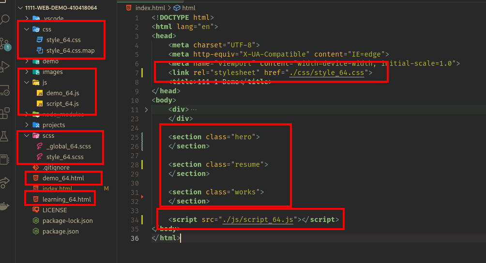
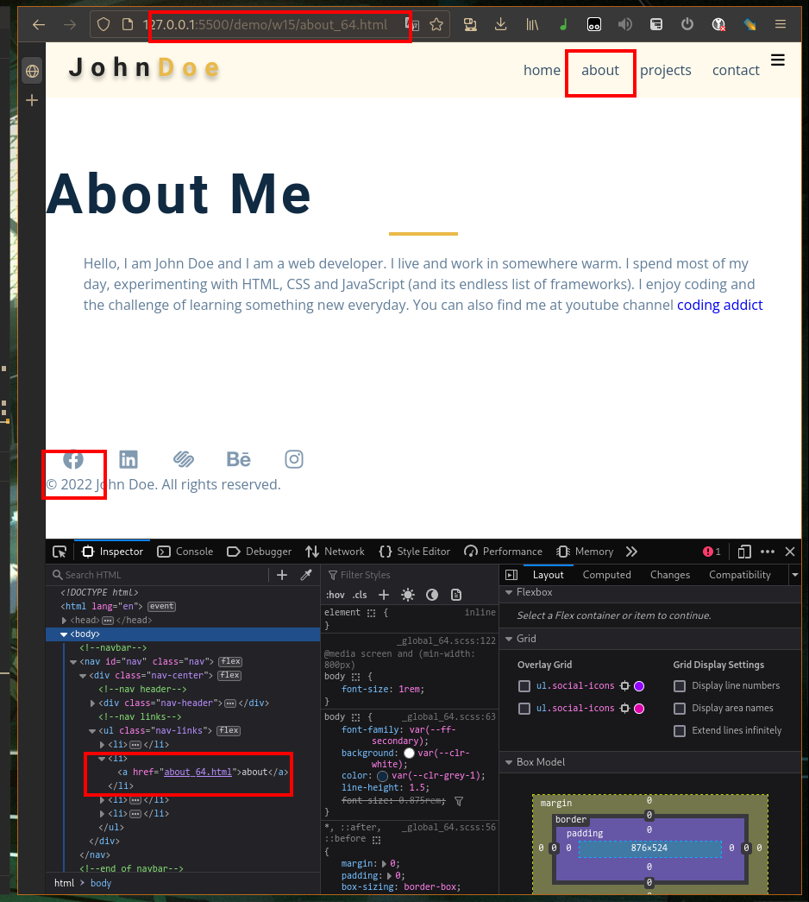
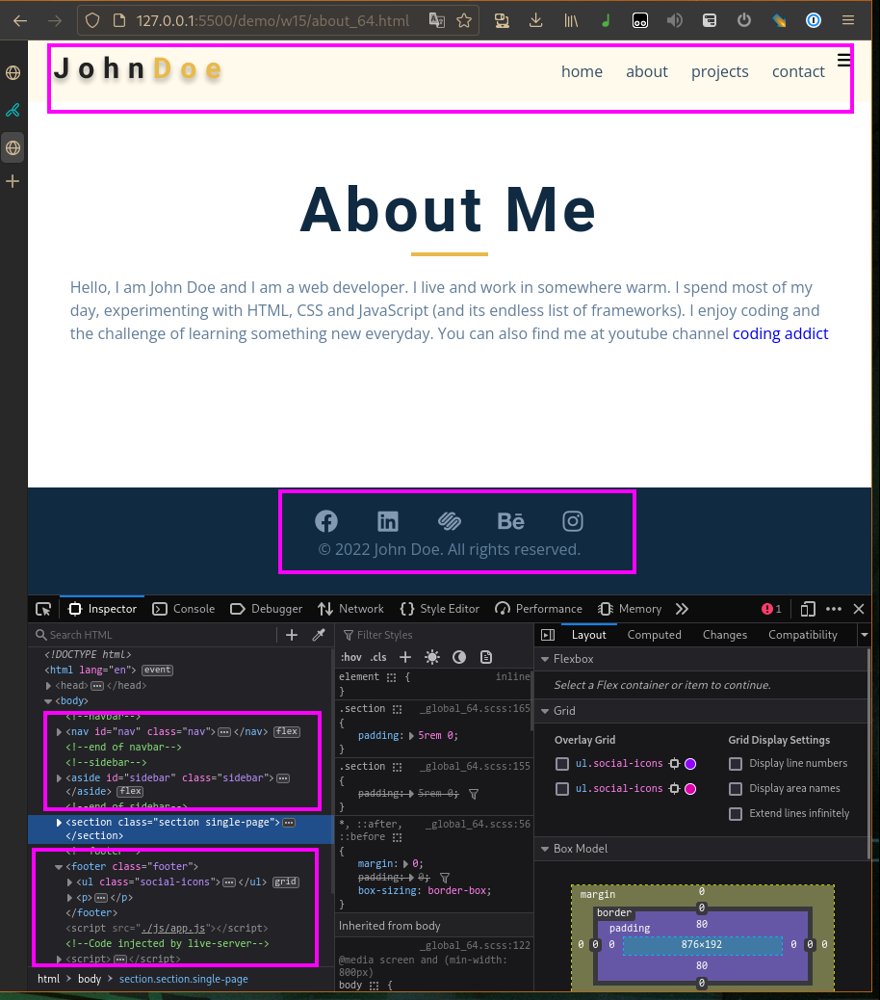
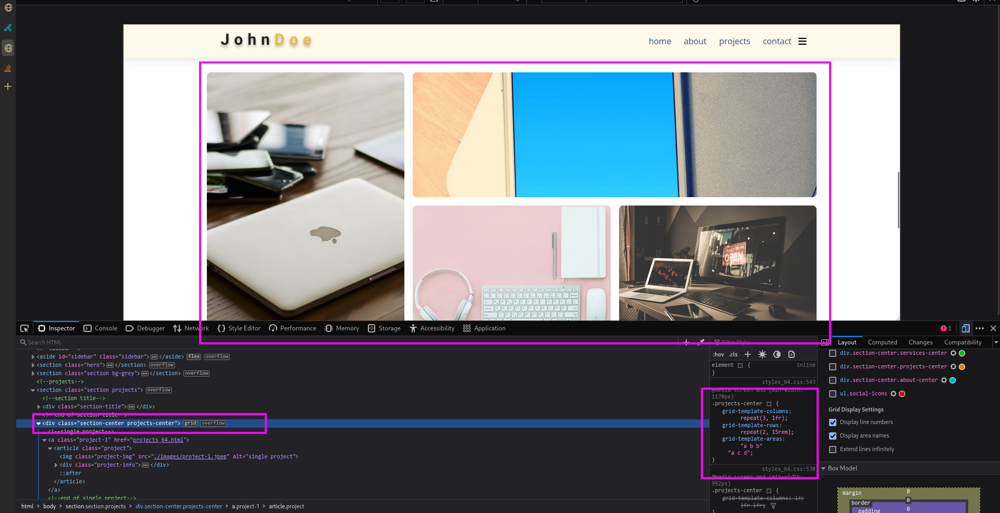
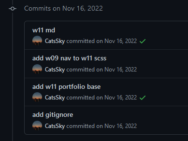
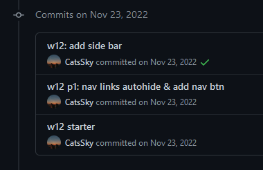
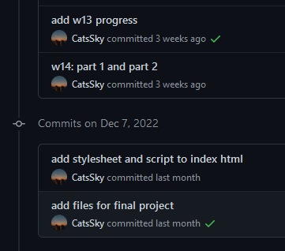
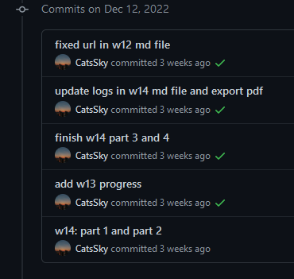
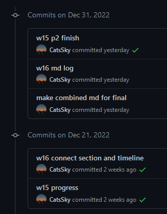

# Webdev

## W14

### GitHub & Vercel URL

[Git Hub URL](https://github.com/CatsSky/1111-web-demo-410418064)

[Vercel URL](https://1111-web-demo-410418064.vercel.app/demo/w14/index.html)

### w14-1: file structure for final project



### w14-2: social icons using global css and custom css


### w14-P3: Services section with responsive design with phone, pad and desktop computer


### w14-P4: finish About section with responsive design with phone, and desktop computer


### w14-logs

```sh
$ git log --pretty=format:"%h%x09%an%x09%ad%x09%s" --after="2022-12-7"

d59e3c1 CatsSky Mon Dec 12 14:17:44 2022 +0800  finish w14 part 3 and 4
8245c16 CatsSky Mon Dec 12 13:53:43 2022 +0800  add w13 progress
b569bcb CatsSky Mon Dec 12 13:33:43 2022 +0800  w14: part 1 and part 2
```

## W15

### GitHub & Vercel URL

[Git Hub URL](https://github.com/CatsSky/1111-web-demo-410418064)

[Vercel URL](https://1111-web-demo-410418064.vercel.app/demo/w15/index.html)

### w15-P1:nav link to about page with navbar and footer




### w15-P2: Latest works using grid-template-areas




### w15-logs

```sh
$ git log --pretty=format:"%h%x09%an%x09%ad%x09%s" --after="2022-12-20"

38db602 CatsSky Sat Dec 31 13:34:50 2022 +0800   w15 p2 finish
6ba8dc7 CatsSky Sat Dec 31 13:34:32 2022 +0800   w16 md log
872e73f CatsSky Sat Dec 31 13:34:11 2022 +0800   make combined md for final
83a795d CatsSky Wed Dec 21 14:51:38 2022 +0800   w16 connect section and timeline
0c3e17a CatsSky Wed Dec 21 13:27:10 2022 +0800   w15 progress
```

## W16

### GitHub & Vercel URL

[Git Hub URL](https://github.com/CatsSky/1111-web-demo-410418064)

[Vercel URL](https://1111-web-demo-410418064.vercel.app/demo/w16/index.html)

### w16-P1: show how to show odd number timeline


### w16-P2: connect section using clip-path


### w16-logs

```sh
$ git log --pretty=format:"%h%x09%an%x09%ad%x09%s" --after="2022-12-20"

83a795d CatsSky Wed Dec 21 14:51:38 2022 +0800  w16 connect section and timeline
```

## w11~w16 log images




