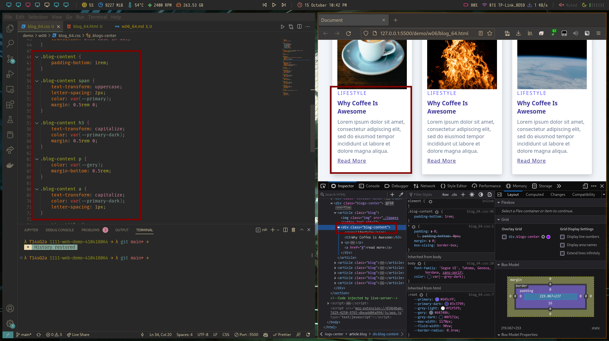
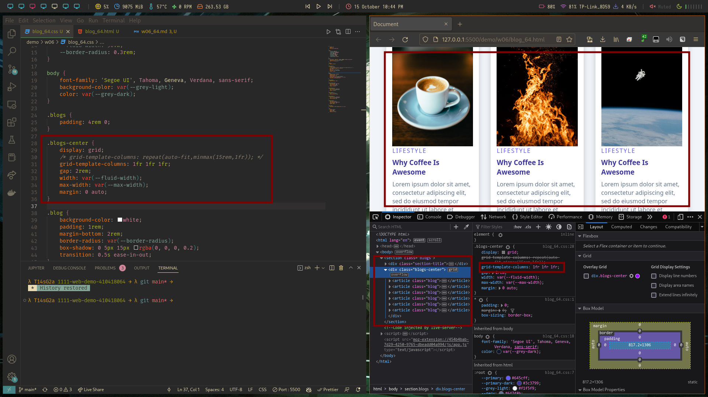
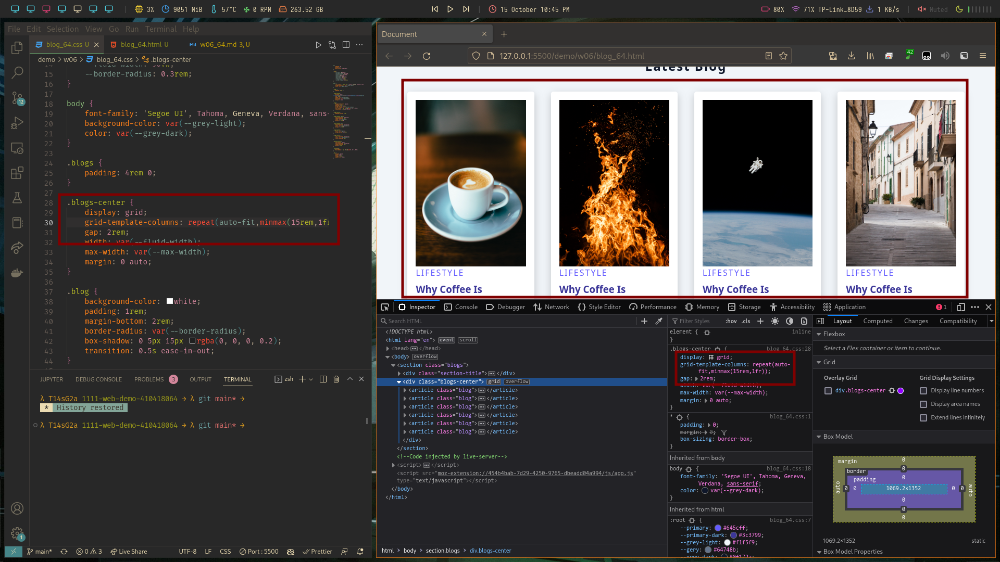

### w06-P1: Add blog content with css


### w06-P2: use css grid to show 3 blogs


### w06-P3: use css grid (minmax) to show 9 blogs


### W06-logs: W6 all logs

```sh
$ git log --pretty=format:"%h%x09%an%x09%ad%x09%s" --after="2022-10-04"
```

```
512cbc1 CatsSky Sat Oct 15 22:47:49 2022 +0800  w06 dynamic grid using auto-fit
2f6230a CatsSky Wed Oct 12 14:20:06 2022 +0800  add w05 blog to index.html
cbcd0f7 CatsSky Wed Oct 12 14:19:10 2022 +0800  w05 blog
a7627b0 CatsSky Wed Oct 12 14:09:58 2022 +0800  w04 md
f13d1f3 CatsSky Wed Oct 12 13:57:04 2022 +0800  add css file to w03 card demo
01369fb CatsSky Wed Oct 12 13:54:18 2022 +0800  add w02 introduction to index.html
c92e681 CatsSky Wed Oct 12 13:53:31 2022 +0800  w02 introduction
3af7bc0 CatsSky Wed Oct 12 13:41:02 2022 +0800  add index.html for redirection
fac11a4 CatsSky Wed Oct 12 13:30:09 2022 +0800  w03 card demo
```