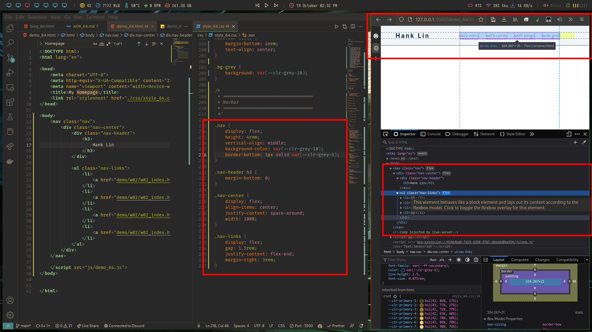
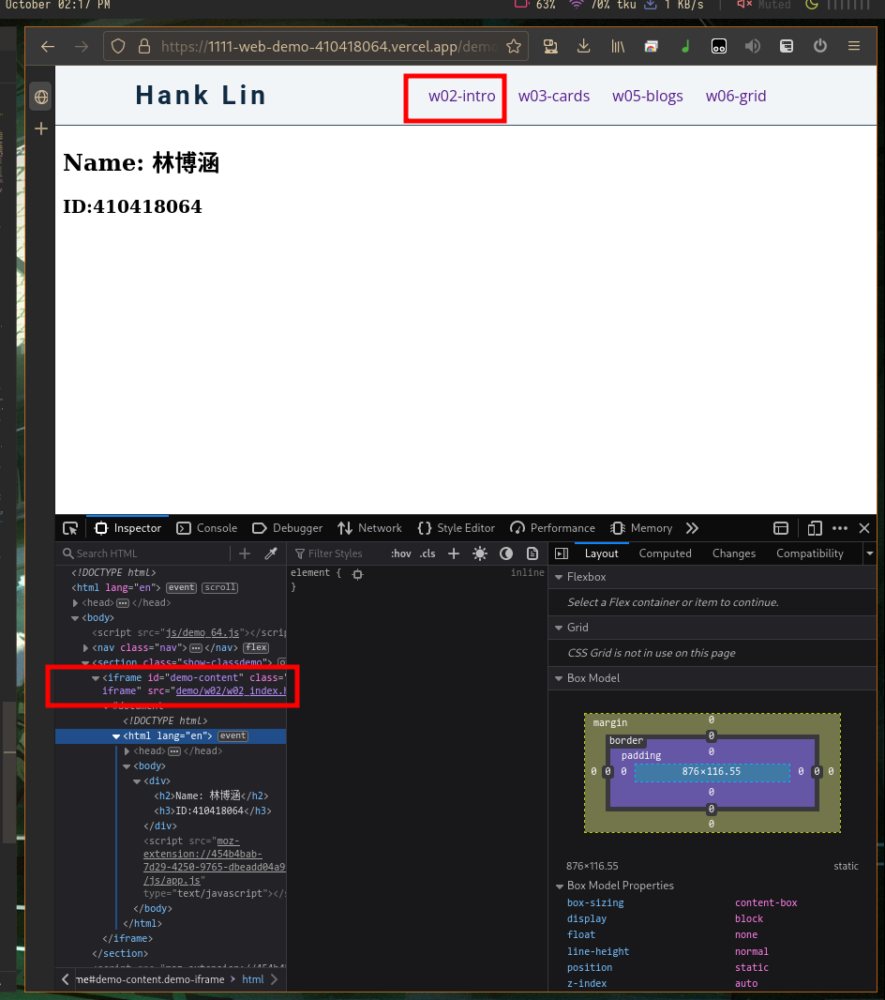
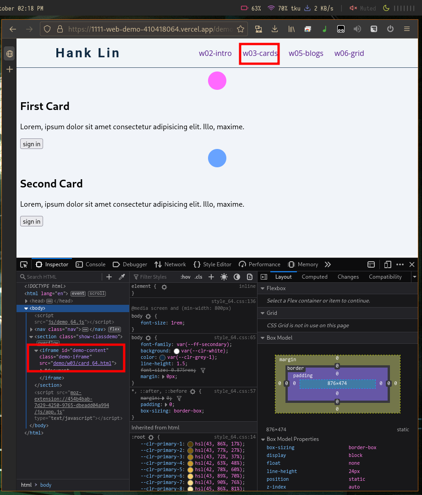
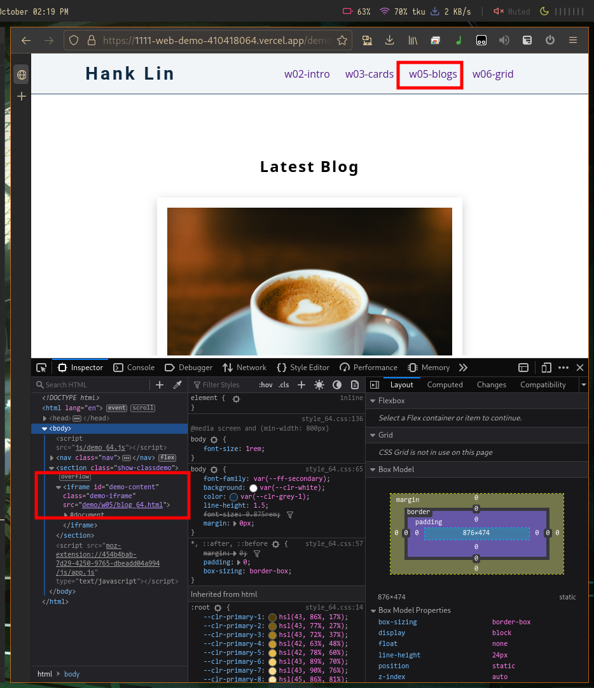
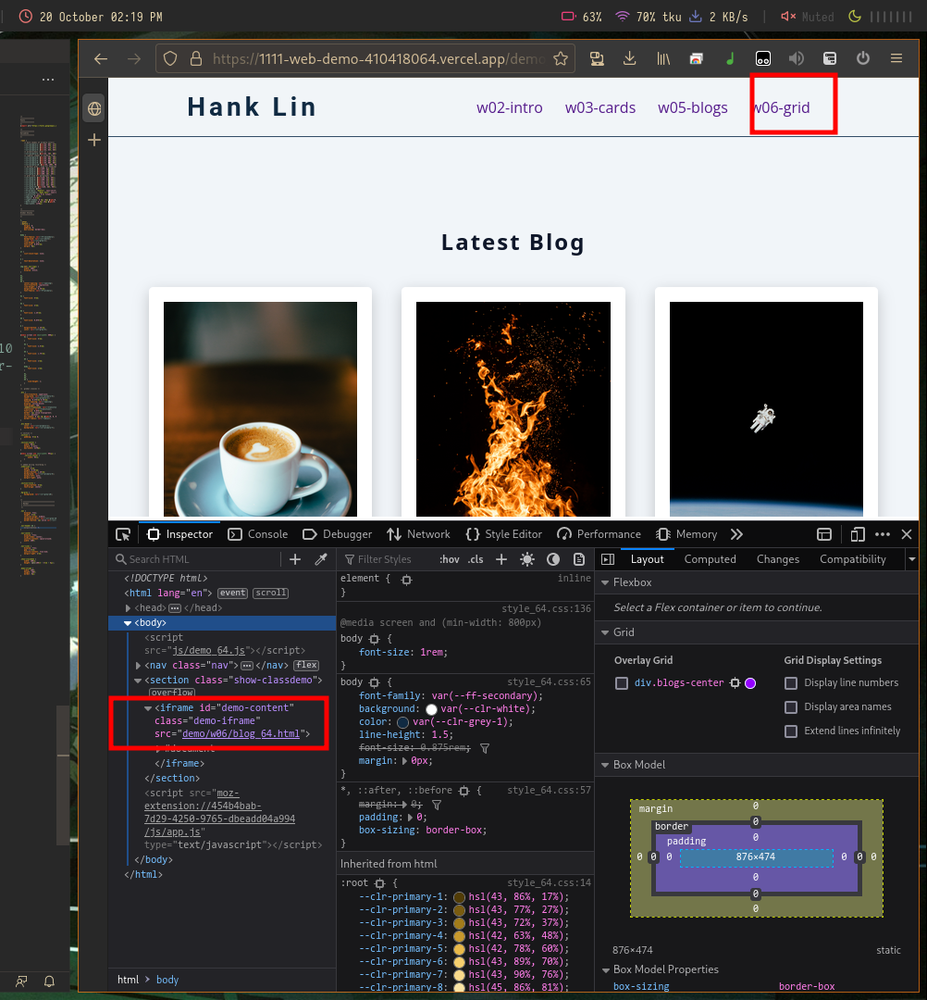

# Webdev

## W07

### GitHub & Vercel URL

[Git Hub URL](https://github.com/CatsSky/1111-web-demo-410418064)

[Vercel URL](https://1111-web-demo-410418064.vercel.app/)

### w07-P1: show nav css



### w07-P2: show four demos in Vercel






### W07-logs: W6 all logs

```sh
$ g log --pretty=format:"%h%x09%an%x09%ad%x09%s" --after="2022-10-18"  

# 33c97b1 CatsSky Wed Oct 19 22:11:09 2022 +0800  add iframe to show embedded demo pages
# 38239d9 CatsSky Wed Oct 19 22:10:32 2022 +0800  add w7 md file
# 8c8612b CatsSky Wed Oct 19 14:36:19 2022 +0800  w07 add nav bar to demo page
# 7ed0a83 CatsSky Wed Oct 19 14:35:46 2022 +0800  migrate md files
# 6671d50 CatsSky Wed Oct 19 13:42:54 2022 +0800  link index.html to demo pageq
```
