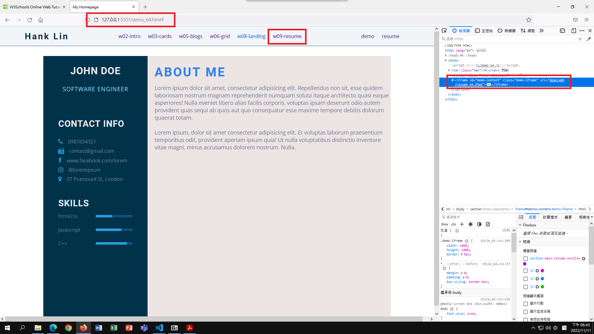
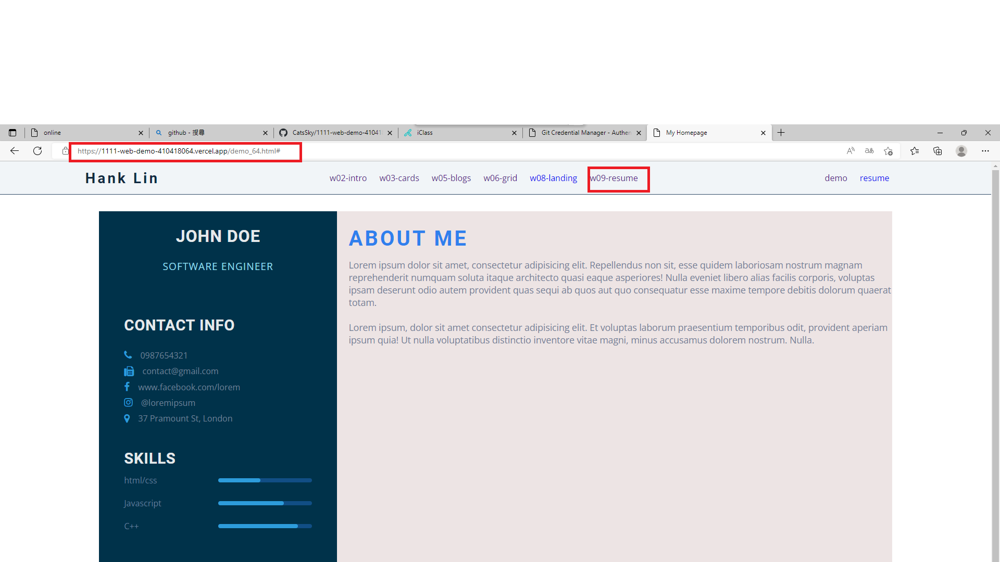

# Webdev

## W10

### GitHub & Vercel URL

[Git Hub URL](https://github.com/CatsSky/1111-web-demo-410418064)

[Vercel URL](https://1111-web-demo-410418064.vercel.app/)

### W10-P1: show w09-resume locally



### W10-P2: show w09-resume from vercel



### W10-P3: show w10_64.md from Github


### W10-logs: show all logs from week 10

```sh
git log --pretty=format:"%h%x09%an%x09%ad%x09%s" --after="2022-11-10"
# a77e4e9 CatsSky Fri Nov 11 18:52:03 2022 +0800  W10 P2: show resume from vercel
# 9083f6c CatsSky Fri Nov 11 18:47:26 2022 +0800  W10 P1: show resume locally
# caa98c4 CatsSky Fri Nov 11 11:08:53 2022 +0800  export midterm md to pdf
# b117fc8 CatsSky Fri Nov 11 11:08:20 2022 +0800  add midterm md
# d71d916 CatsSky Fri Nov 11 10:53:46 2022 +0800  add resume
# f17b201 CatsSky Fri Nov 11 10:03:11 2022 +0800  update demo link
# 37eebfc CatsSky Fri Nov 11 09:55:05 2022 +0800  finish w09 md
# 9a25cf4 CatsSky Fri Nov 11 09:50:20 2022 +0800  finish w09 resume
```
