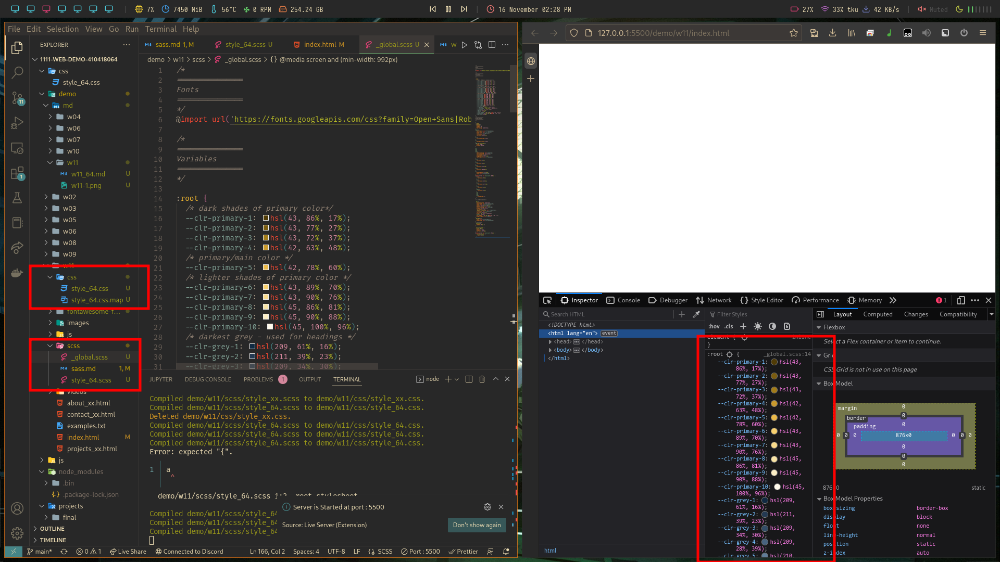
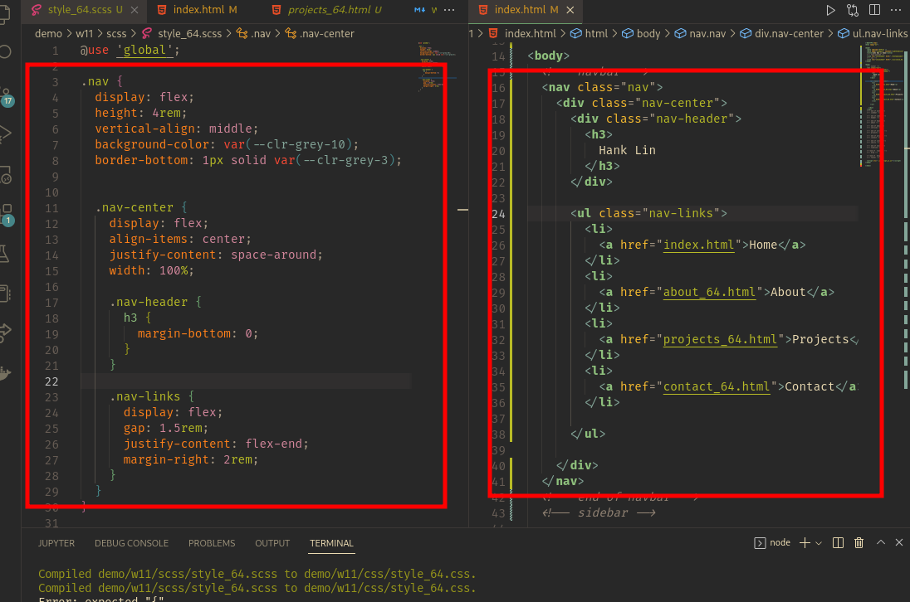
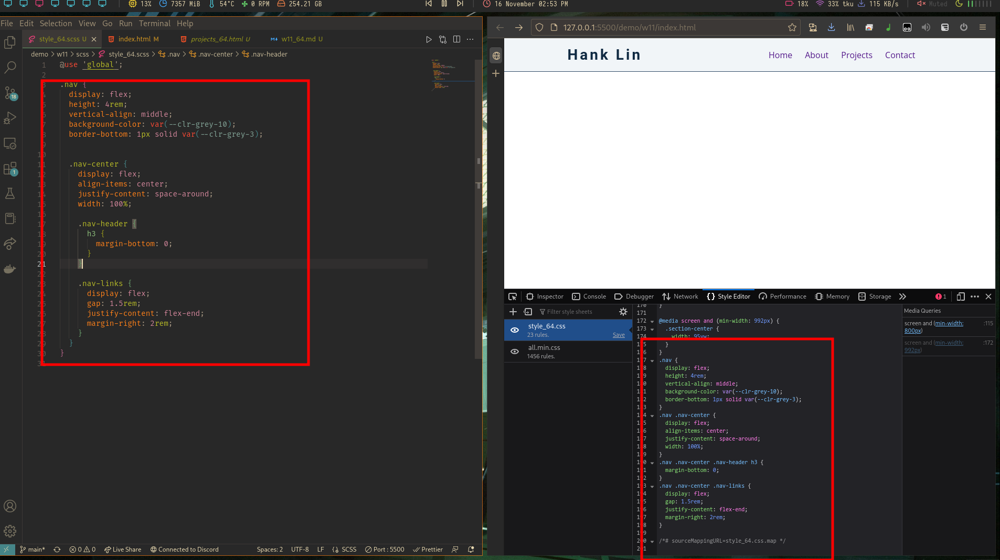

# Webdev

## W11

### GitHub & Vercel URL

[Git Hub URL](https://github.com/CatsSky/1111-web-demo-410418064)

[Vercel URL](https://1111-web-demo-410418064.vercel.app/)

### w11-P1: setup SASS, style_xx.scss compile to style_xx.css



### w11-P2: modify w09 nav into scss




### w11-logs

```sh
$ git log --pretty=format:"%h%x09%an%x09%ad%x09%s" --after="2022-11-15"

145eddb CatsSky Wed Nov 16 14:54:52 2022 +0800  add w09 nav to w11 scss
cf21362 CatsSky Wed Nov 16 14:02:40 2022 +0800  add w11 portfolio base
4c6fe3a CatsSky Wed Nov 16 14:01:57 2022 +0800  add gitignore
```
