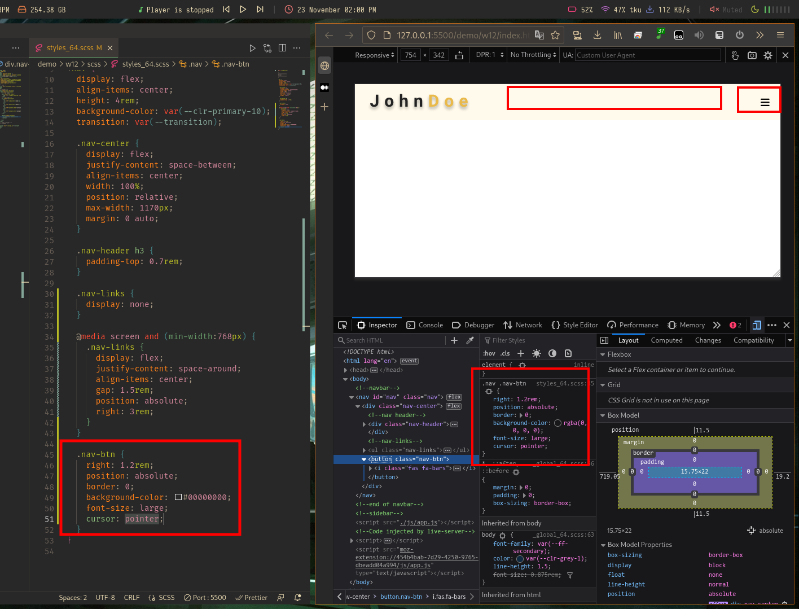
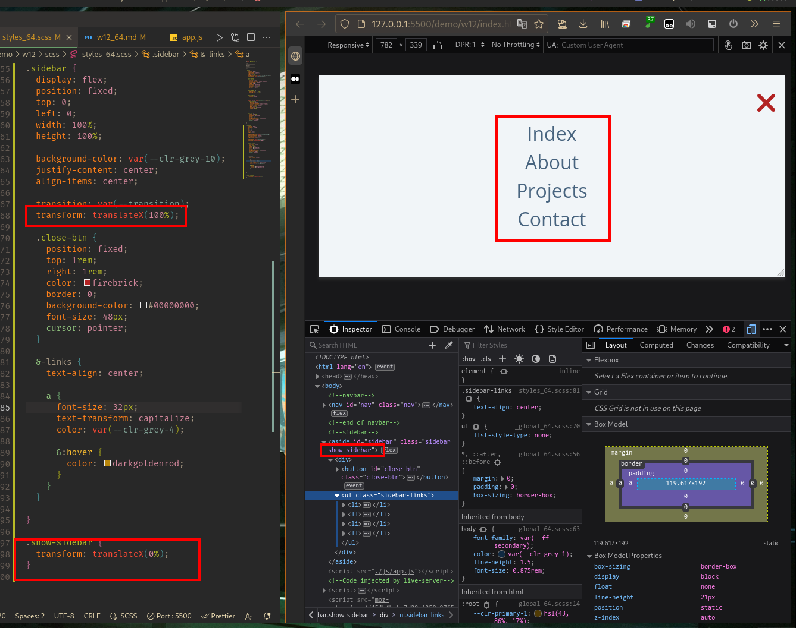

# Webdev

## W11

### GitHub & Vercel URL

[Git Hub URL](https://github.com/CatsSky/1111-web-demo-410418064)

[Vercel URL](https://1111-web-demo-410418064.vercel.app/demo/w12/index.html)

### w12-P1: create nav-btn nav-links display none



### w12-P2: nav-btn and close-btn works



### w12-logs

```sh
$ git log --pretty=format:"%h%x09%an%x09%ad%x09%s" --after="2022-11-20"

3cbf4a5 CatsSky Wed Dec 7 13:39:03 2022 +0800   add stylesheet and script to index html
b061ea5 CatsSky Wed Dec 7 13:33:14 2022 +0800   add files for final project
89a0272 CatsSky Wed Nov 23 15:03:44 2022 +0800  w12: add side bar
fd389b3 CatsSky Wed Nov 23 14:06:58 2022 +0800  w12 p1: nav links autohide & add nav btn
6988cba CatsSky Wed Nov 23 13:23:07 2022 +0800  w12 starter
```
