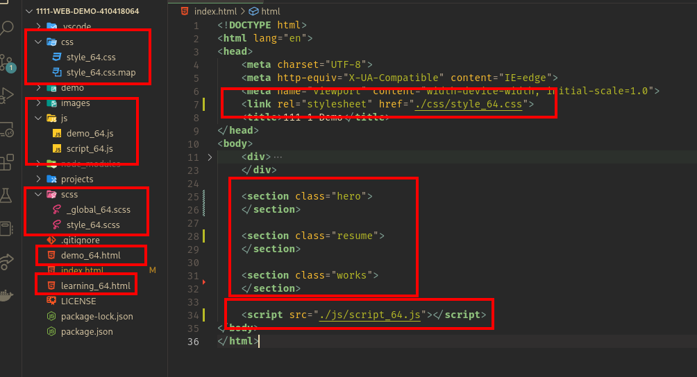
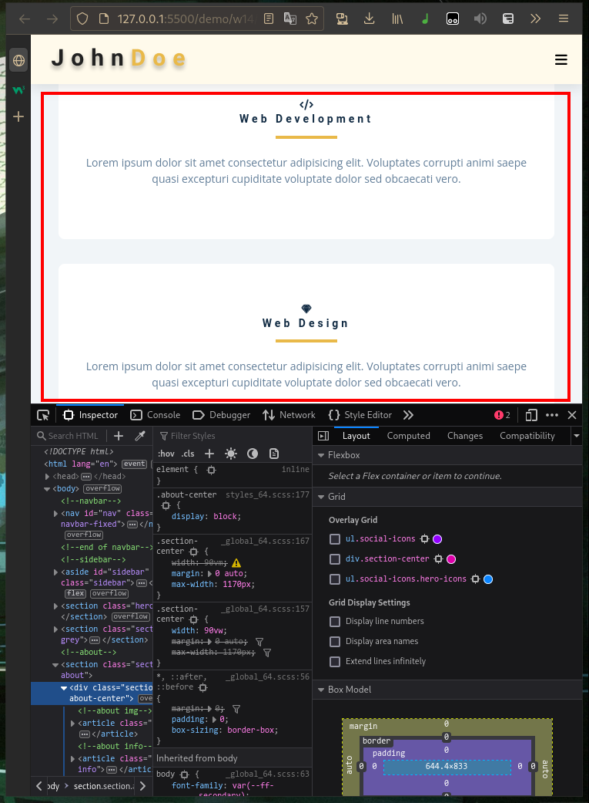
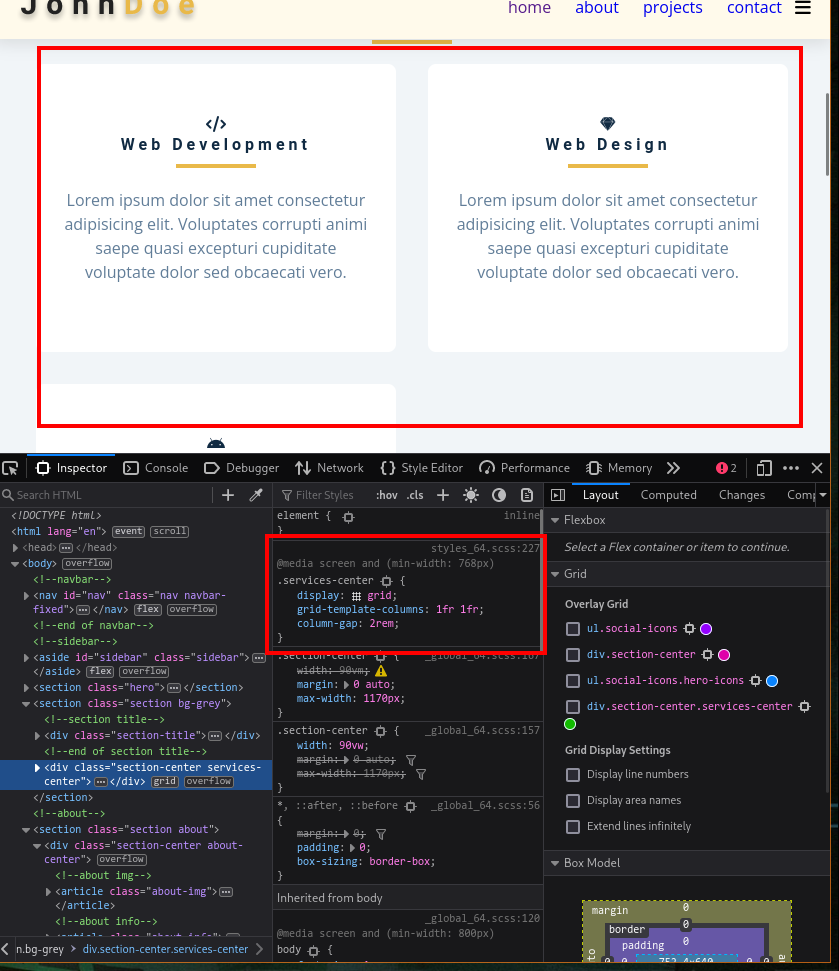
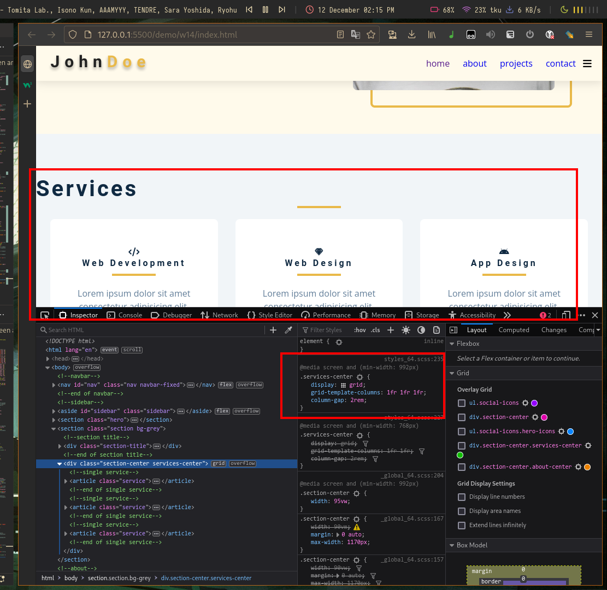
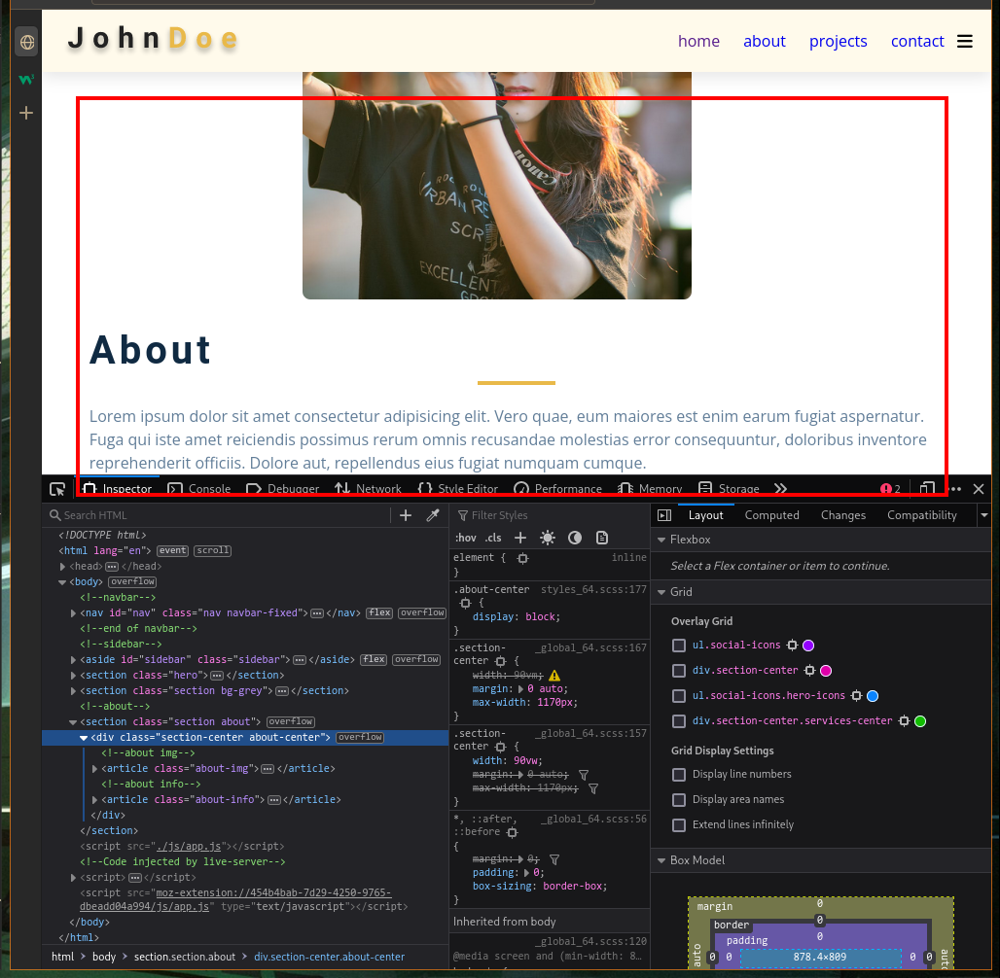
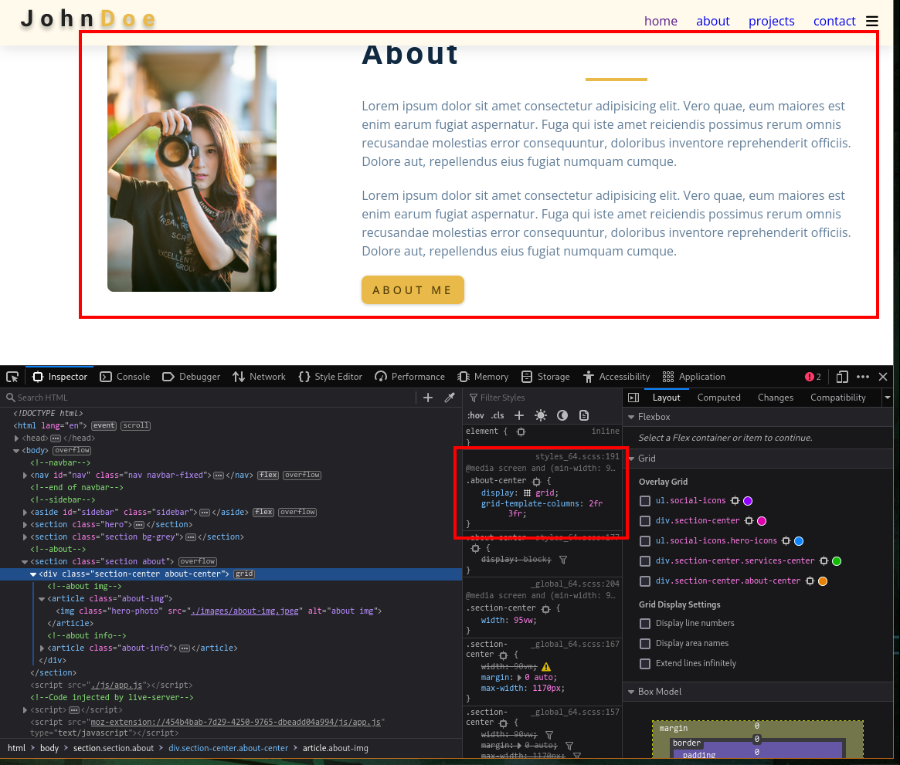

# Webdev

## W14

### GitHub & Vercel URL

[Git Hub URL](https://github.com/CatsSky/1111-web-demo-410418064)

[Vercel URL](https://1111-web-demo-410418064.vercel.app/demo/w14/index.html)

### w14-1: file structure for final project



### w14-2: social icons using global css and custom css


### w14-P3: Services section with responsive design with phone, pad and desktop computer





### w14-P4: finish About section with responsive design with phone, and desktop computer




### w14-logs

```sh
$ git log --pretty=format:"%h%x09%an%x09%ad%x09%s" --after="2022-12-7"

d59e3c1 CatsSky Mon Dec 12 14:17:44 2022 +0800  finish w14 part 3 and 4
8245c16 CatsSky Mon Dec 12 13:53:43 2022 +0800  add w13 progress
b569bcb CatsSky Mon Dec 12 13:33:43 2022 +0800  w14: part 1 and part 2
```
