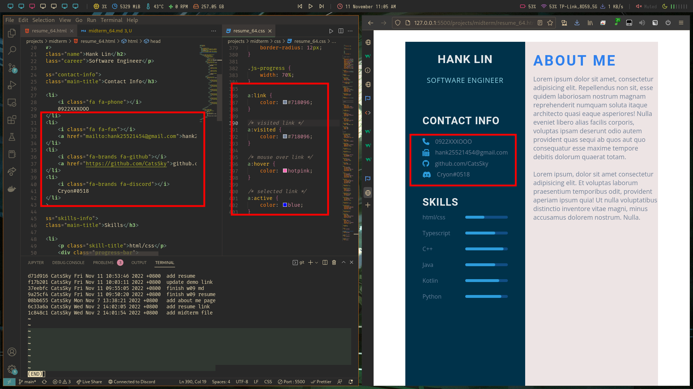

# Webdev

## Midterm

### GitHub & Vercel URL

[Git Hub URL](https://github.com/CatsSky/1111-web-demo-410418064)


[Vercel URL](https://1111-web-demo-410418064.vercel.app/)


### md file strcture


### midterm-P1: class demo of week and week 9

[Week 9 md Github URL](https://github.com/CatsSky/1111-web-demo-410418064/blob/main/projects/midterm/md/w09_64.md)


### midterm-P3: resume

#### add links to contact info



#### expand skill section


### midterm-logs: all logs

```sh
git log --pretty=format:"%h%x09%an%x09%ad%x09%s" --after="2022-10-25"
# d71d916 CatsSky Fri Nov 11 10:53:46 2022 +0800  add resume
# f17b201 CatsSky Fri Nov 11 10:03:11 2022 +0800  update demo link
# 37eebfc CatsSky Fri Nov 11 09:55:05 2022 +0800  finish w09 md
# 9a25cf4 CatsSky Fri Nov 11 09:50:20 2022 +0800  finish w09 resume
# 08bb655 CatsSky Mon Nov 7 13:38:21 2022 +0800   add about me page
# 6c33a6a CatsSky Wed Nov 2 14:02:05 2022 +0800   add resume link
# 1c848c1 CatsSky Wed Nov 2 14:01:54 2022 +0800   add midterm file
```